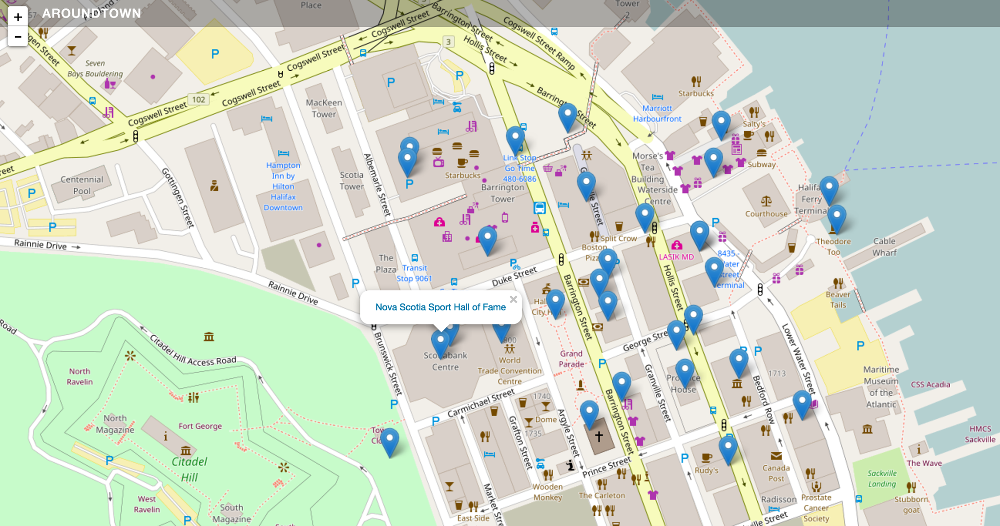

# AroundTown

#### What is AroundTown?

AroundTown is a great way to gain more information about whats around you. Wether you are in a new town looking for something to do or in your home town looking for something new. See a live demo [here](https://ericbezanson.github.io/AroundTown/#/).

###### Note:
<em> This application uses $routeParams to route. In the background, this angular module makes AJAX requests. If you try to run this application locally it would need to run on a local server. For more information on how to accomplish this look [here](https://medium.com/@jonsamp/starting-a-server-in-angular-cd3ab7a4e4de#.v6rkyd2kr)

#### How does it work?

1. It uses an anuglar API called [LeafLet](http://leafletjs.com/) to produce a map based on latitude/longtiude coordinates passed in through an angular controller 

2. It also passes those latitude/longtiude coordinates into The Wikipedia Geodata API returning a JSON object containing an array of Wikipedia articles near the given coordinates, in this case the latitude and longitude lat: 44.6488, lng: -63.5752 for Halifax, NS.

